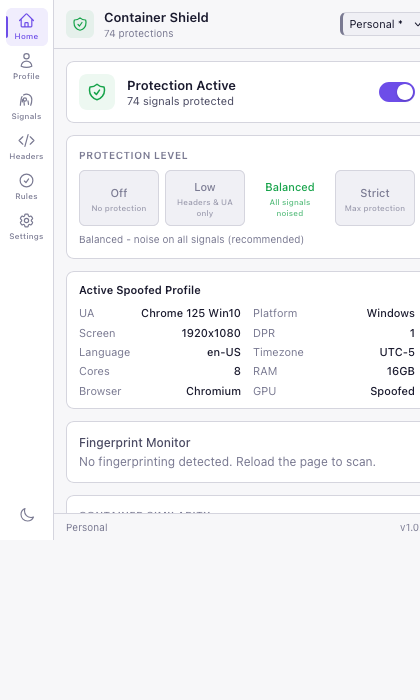
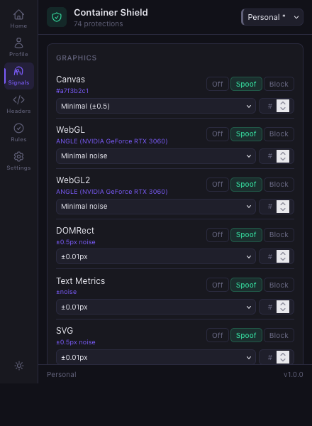
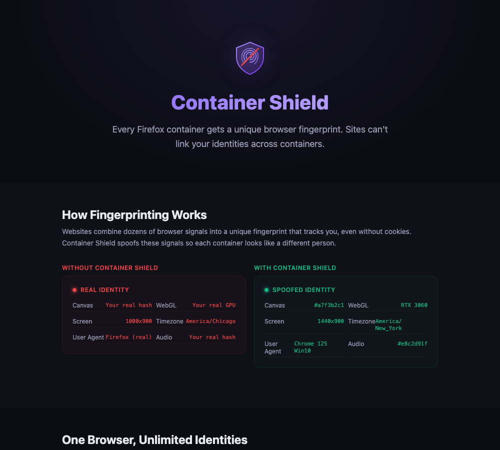

<p align="center">
  
</p>

<h1 align="center">Container Shield</h1>

<p align="center">
  <strong>Per-container fingerprint protection for Firefox Multi-Account Containers</strong>
</p>

<p align="center">
  Every container gets a unique browser identity. Sites can't link you across containers.
</p>

<p align="center">
  
  
  
  
</p>

<p align="center">
  <a href="#the-problem">Problem</a> &nbsp;·&nbsp;
  <a href="#how-it-works">Solution</a> &nbsp;·&nbsp;
  <a href="#screenshots">Screenshots</a> &nbsp;·&nbsp;
  <a href="#signals-protected">Signals</a> &nbsp;·&nbsp;
  <a href="#installation">Install</a> &nbsp;·&nbsp;
  <a href="#limitations">Limitations</a>
</p>

---

## The Problem

Websites fingerprint your browser using 70+ subtle signals — canvas rendering, WebGL GPU info, audio processing, screen dimensions, installed fonts, timezone, and more. This creates a **unique identifier that persists even when you clear cookies**.

```
You ──── Container "Personal"  ──► amazon.com sees Fingerprint X
   └──── Container "Work"      ──► amazon.com sees Fingerprint X  ← SAME! Linked.
   └──── Container "Shopping"  ──► amazon.com sees Fingerprint X  ← SAME! Linked.
```

Firefox Multi-Account Containers isolate cookies and storage, but **fingerprints are identical** across all containers because they come from your real hardware.

## How It Works

Container Shield intercepts fingerprinting APIs at the JavaScript level and returns **spoofed values unique to each container**.

```
You ──── Container "Personal"  ──► amazon.com sees Fingerprint A  (Chrome/Win/RTX 3060)
   └──── Container "Work"      ──► amazon.com sees Fingerprint B  (Safari/Mac/Apple M2)
   └──── Container "Shopping"  ──► amazon.com sees Fingerprint C  (Firefox/Linux/RX 6700)
```

Each fingerprint is:
- **Deterministic** — same container + same domain = same fingerprint every time
- **Consistent** — all signals match (a Windows UA gets a Windows screen size, Windows GPU, etc.)
- **Unique** — no two containers share the same fingerprint
- **Realistic** — values come from real browser profiles, not random noise

### Architecture

```
┌──────────────────────────────────────────────────────────────────┐
│  Background Script                                               │
│  ┌──────────┐ ┌──────────┐ ┌──────────┐ ┌──────────┐            │
│  │Container │ │ Profile  │ │ Header   │ │   IP     │            │
│  │ Manager  │ │ Manager  │ │ Spoofer  │ │Isolation │            │
│  └──────────┘ └──────────┘ └──────────┘ └──────────┘            │
├──────────────────────────────────────────────────────────────────┤
│  Inject Script (world: "MAIN" — runs before page scripts)       │
│  ┌──────────────────────────────────────────────────────┐        │
│  │ 70+ API Spoofers: Canvas, WebGL, Audio, Screen,     │        │
│  │ Navigator, Timezone, Fonts, Workers, iFrames, ...    │        │
│  └──────────────────────────────────────────────────────┘        │
├──────────────────────────────────────────────────────────────────┤
│  Popup UI (React + Tailwind)                                     │
│  Dashboard │ Signals │ Profile │ Headers │ Rules │ Settings      │
└──────────────────────────────────────────────────────────────────┘
```

---

## Screenshots

<table>
<tr>
<td width="33%">

**Dashboard** — Protection status, spoofed profile, fingerprint monitor



</td>
<td width="33%">

**Signals** — Per-signal Off/Spoof/Block with live values



</td>
<td width="33%">

**Onboarding** — Before/after fingerprint comparison



</td>
</tr>
</table>

> Regenerate: `npx tsx scripts/take-screenshots.ts`

---

## Signals Protected

Container Shield spoofs **70+ fingerprinting signals** across 15 categories:

| Category | Signals | What Sites See |
|----------|---------|----------------|
| **Graphics** | Canvas, WebGL, WebGL2, WebGPU, SVG, DOMRect, TextMetrics, OffscreenCanvas, Shaders | Unique canvas hash, spoofed GPU (e.g. RTX 3060), noised geometry |
| **Audio** | AudioContext, OfflineAudio, Latency, Codecs | Unique audio fingerprint hash, standardized codec responses |
| **Hardware** | Screen, Orientation, Memory, CPU, Battery, Touch, Sensors, Viewport, Architecture | Profile-matched resolution, core count, memory |
| **Navigator** | User-Agent, Languages, Plugins, Client Hints, Clipboard, Vibration, Vendor Flavors | Complete browser identity (e.g. "Chrome 125 on Windows 11") |
| **Timezone** | Intl.DateTimeFormat, Date.getTimezoneOffset | Spoofed timezone (e.g. America/New_York) |
| **Fonts** | Font Enumeration, CSS Font Detection, Font Preferences | Platform-appropriate font list |
| **Network** | WebRTC, Connection, Geolocation, WebSocket | Public IP only (no local leak), spoofed connection profile |
| **Timing** | performance.now(), Memory, Event Loop | Reduced precision, randomized heap, ±jitter |
| **CSS** | Media Queries | Spoofed prefers-color-scheme, pointer, hover |
| **Workers** | Dedicated, Shared, Service, AudioWorklet | Preamble injection matches main thread values |
| **Storage** | StorageEstimate, IndexedDB, WebSQL, Private Mode | Randomized quotas |
| **Permissions** | Permissions API, Notifications | Consistent default responses |
| **Devices** | Gamepad, MIDI, Bluetooth, USB, Serial, HID | Empty/blocked device lists |
| **Other** | Math, Keyboard, Speech, Crypto, Errors, Apple Pay, Intl | Normalized math precision, spoofed voices, timing jitter |
| **Headers** | User-Agent, Accept-Language, header order | HTTP headers match JS-level spoofing |

### Protection Modes

Each signal supports three modes:

| Mode | Behavior | Use Case |
|------|----------|----------|
| **Off** | Real values returned | Trusted sites |
| **Spoof** | Deterministic noise added | Recommended (default) |
| **Block** | Fake/empty values returned | Maximum privacy |

### Protection Levels

| Level | Description |
|-------|-------------|
| **Off** | No spoofing |
| **Low** | Light noise, minimal site breakage |
| **Balanced** | Strong protection + site compatibility (default) |
| **Strict** | Maximum privacy, may break some sites |

---

## Features

### Per-Container Isolation

Each Firefox container gets a unique 256-bit cryptographic seed. All spoofed values are derived deterministically from this seed — same seed + same domain = same fingerprint, always.

### Real Browser Profiles

35+ profiles from real browsers: Chrome, Firefox, Safari, Edge on Windows, macOS, Linux, Android, iOS. Each profile includes matching UA, platform, screen, GPU, CPU cores, memory, and Client Hints.

### Fingerprint Monitor

Real-time dashboard showing which fingerprinting APIs the current page accessed, whether each was spoofed/blocked/exposed, and recommendations for APIs to enable.

### Auto-Rotation

Optionally rotate fingerprints on a schedule (session, hourly, daily, weekly) or manually with one click.

### IP Conflict Detection

Warns when two containers access the same IP address, preventing cross-container correlation.

### Worker & iFrame Spoofing

Injects spoofer preamble into Web Workers (Dedicated + Shared) and patches iFrame contentWindow/contentDocument so values match the main thread. ServiceWorker registration is blocked with fallback to spoofed SharedWorker.

### Header Spoofing

HTTP headers (User-Agent, Accept-Language, header order) are modified via webRequest to match the JS-level spoofed profile. Tracking pixels and known tracker domains are blocked.

### DNS Leak Prevention

Enables DNS-over-HTTPS and blocks DNS leak test domains to prevent real IP exposure through DNS queries.

### Keyboard Shortcuts

| Shortcut (Mac) | Shortcut (Win/Linux) | Action |
|---------|---------|--------|
| `Ctrl+Shift+P` | `Alt+Shift+P` | Toggle protection |
| `Ctrl+Shift+R` | `Alt+Shift+R` | Rotate fingerprint |
| `Ctrl+Shift+E` | `Alt+Shift+E` | Toggle site exception |
| `Ctrl+Shift+C` | `Alt+Shift+C` | Open popup |

---

## Installation

### From Source

```bash
git clone https://github.com/roshin8/containershield.git
cd containershield
npm install
npm run build
```

### Load in Firefox

1. Open `about:debugging#/runtime/this-firefox`
2. Click **Load Temporary Add-on**
3. Select `dist/manifest.json`

### Development

```bash
npm run dev             # Dev build (watch mode)
npm run run:extension   # Launch Firefox with extension loaded
npm run test            # Unit tests (vitest)
npm run test:e2e        # E2E tests (playwright + real sites)
npm run test:real       # Full real extension test on CreepJS/fingerprint.com
npm run type-check      # TypeScript check
npm run package         # Build + zip for AMO submission
```

### Project Structure

```
src/
├── background/         # Background script: containers, settings, headers, IP isolation
├── content/            # Content script: message bridge (page ↔ background)
├── inject/             # Page-context spoofers (world: "MAIN", runs before page scripts)
│   ├── spoofers/       # 70+ API wrappers organized by category
│   └── monitor/        # Fingerprint access monitoring
├── popup/              # React popup UI (Dashboard, Signals, Profile, Headers, Rules, Settings)
├── pages/              # Full-page UIs (onboarding, options, test runner)
├── lib/                # Shared utilities (crypto, PRNG, profiles, constants)
└── types/              # TypeScript type definitions
```

---

## Tested Against

Container Shield is verified against real fingerprinting sites:

| Site | Status |
|------|--------|
| [CreepJS](https://abrahamjuliot.github.io/creepjs/) | Unique fingerprint per container, worker/iframe values match |
| [fingerprint.com](https://fingerprint.com/demo/) | Different visitor ID per container |
| [BrowserLeaks](https://browserleaks.com/) | Canvas, WebGL, fonts, screen all spoofed |
| [AmIUnique](https://amiunique.org/) | Distinct fingerprint per container |

---

## Limitations

Container Shield provides strong JS-level fingerprint protection, but some techniques are outside extension control:

| Limitation | Why | Mitigation |
|-----------|-----|------------|
| **TLS/JA3 fingerprinting** | TLS handshake is browser-level, not interceptable by extensions | Use [Camoufox](https://camoufox.com/) for TLS-level protection |
| **HTTP/2 SETTINGS** | Browser sends unique H2 settings per browser build | None at extension level |
| **TCP/IP stack** | OS-level TCP window sizes, TTL reveal real OS | VPN or Tor |
| **IP correlation** | Same IP across containers links them | Use VPN/Tor per container |
| **Login-based tracking** | Same account in multiple containers = trivially linked | Use different accounts |
| **System fonts (CSS)** | Some CSS-level font probing bypasses JS interception | Partially mitigated via font preference spoofing |
| **ServiceWorker injection** | Firefox doesn't allow injecting into SW scripts | Block SW → SharedWorker fallback |
| **Extension detection** | Sophisticated trackers may detect spoofing | Stealth techniques minimize this |

---

## Privacy

Container Shield is **100% local**:
- No data collected
- No telemetry
- No external servers contacted
- All fingerprint generation happens in your browser
- Open source and auditable

---

## License

[GPL-3.0](LICENSE)

---

<p align="center">
  <sub>Built with TypeScript, React, and the Firefox WebExtensions API</sub>
</p>
